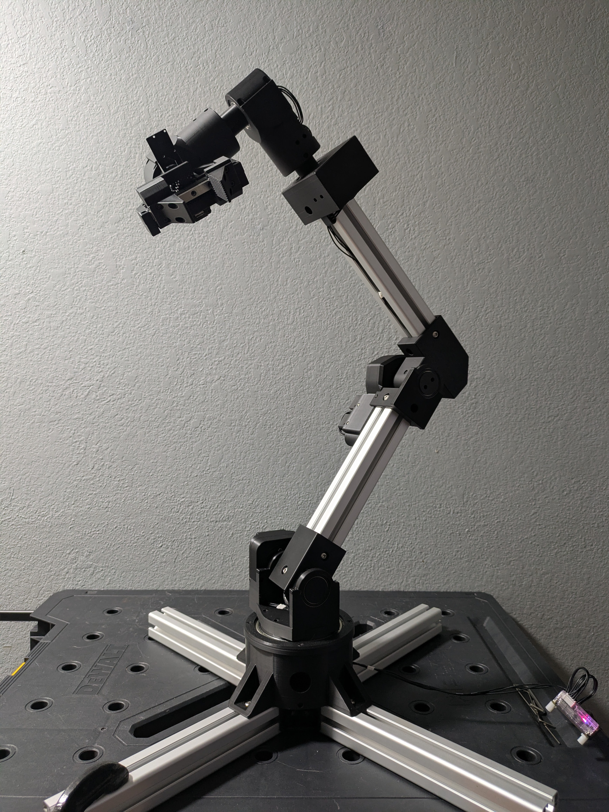

# Manuel 1.0: Open-source robotic arm

Video: https://www.youtube.com/watch?v=q0eZf5LdW8s

This is an open-source robotic arm I made as a hobby project. It's flexible,
similar in size to a human arm, and relatively inexpensive. Besides a 3D
printer and a computer, no expensive tools (>$50) are required to build it.
Feel free to build and use this robot however you like, as long as it's safe.
I sincerely hope that someone besides me can find some use or enjoyment out of
this project.

Features:
* This robot is substantially cheaper than all commercial robotic arms (that I
know of) with similar size and torque capabilities.
* This arm is made entirely with 3D-printed components and mass-produced
parts you can find online. If you have a 3D printer, some cheap hobby tools,
and money for parts, you can build it.
* There are 7 motors: 6 degrees of freedom + a gripper.
* 4 out of 6 joints (waist + 3 wrist joints) can turn more than 360 degrees.
* Wrist joints allow the gripper to rotate completely in all 3 axes when
unobstructed. The gripper can point forward, backward, up, down, left, right,
and anywhere inbetween only by moving the wrist.
* The arm as I designed it reaches 860 mm from shoulder to gripper tip. That's
similar in length to a human arm. You can change the length by using shorter or
longer T-slot extrusions (mine are 300 mm each). A shorter arm will vibrate
less or be able to lift more.
* Using the length that I used, the arm can hold a 1 kg payload when extended.
* All motors are from the [Dynamixel X](https://www.robotis.us/x-series/)
series from Robotis. Robotis has excellent documentation and code resources,
so it is fairly straightforward to control the joints with any of their
[SDKs](https://github.com/ROBOTIS-GIT/DynamixelSDK) written in Python, C++,
Java, C#, and more. Linux, Windows, and Mac are all supported, and you can
connect the robot to a computer with USB.
* All motors are backdrivable.
* All 3D-printed components can be printed with standard PLA filament. For many
3D printers such as my Bambu Lab A1, no supports are needed.
* All components can be removed and replaced. No glue is used anywhere. Most
plastic components are connected with M3 screws and heat set inserts.
* Cables are well organized. If you follow the recommended cable lengths, you
shouldn't have any annoying dangling wires. Of course you will have to adjust
the cable lengths if you choose extrusions that are not 300 mm.

## Tips

* I recommend putting a maximum acceleration of "10" on all motors using the
[profile acceleration](https://emanual.robotis.com/docs/en/dxl/x/xl430-w250/#profile-acceleration)
setting. Acceleration that is too high will cause joints to vibrate, and you
won't get good accuracy. You can later adjust this as you see fit.
* I use 0.2mm Standard 3D printer settings for all parts except for the gears.
For the gears, I increase the wall loops to 4 to try to fill all of the teeth
completely.
* Some of the printed components have a small overhang inside the screw hole
where the screw meets the plastic. My printer can do some overhangs, but often
it leaves plastic threads sticking around, and the hole is often too small. You
can fix this by taking a small allen wrench and forcing it through the hole.
Then take a bigger one and do it again. Eventually you'll be able to fit the
screw in there.

## Tools needed

* Any computer with a USB port
* 3D printer that can print PLA; bed size should be at least 17 cm x 17 cm
* Soldering iron
* Crimping tool that can crimp
[JST SEH-001T-P0.6](https://emanual.robotis.com/docs/en/dxl/x/xl430-w250/#connector-information)
* Wire stripper
* Lighter or some kind of heat source for heating heat shrinks
* 2mm Phillips screwdriver
* Hex drivers / allen wrenches, sizes 1.5mm, 2.0mm, 2.5mm, and 4mm
* Pliers
* Flathead screwdriver
* Table clamps

## Bill of materials

Item | Minimum needed | Bundle price | Total price
-|-|-|-
Motors and electronics
[DYNAMIXEL XM540-W270-T](https://www.robotis.us/dynamixel-xm540-w270-t/) | 2 | $482.89 | $965.78
[DYNAMIXEL XM430-W350-T](https://www.robotis.us/dynamixel-xm430-w350-t/) | 3 | $310.39 | $931.17
[DYNAMIXEL XL430-W250-T](https://www.robotis.us/dynamixel-xl430-w250-t/) | 2 | $27.50 | $55.00
[DYNAMIXEL starter set including U2D2 USB converter](https://robotis.us/dynamixel-starter-set-us/) | 1 | $68.66 | $68.66
Bearings and rails
[95x120x13mm bearing](https://www.amazon.com/dp/B0DD4B5DLV?ref=ppx_yo2ov_dt_b_fed_asin_title&th=1) | 1 | $16.99 | $16.99
[30x42x7mm bearings](https://www.amazon.com/dp/B082PXK5K9?ref=ppx_yo2ov_dt_b_fed_asin_title&th=1) | 10 | $15.19 / 10 | $15.19
[17x23x4mm bearings](https://www.amazon.com/dp/B0CRBBMTXD?ref=ppx_yo2ov_dt_b_fed_asin_title&th=1) | 4 | $13.29 / 10 | $13.29
[100mm linear rail with carriage](https://www.amazon.com/dp/B09SD9GXVP?ref=ppx_yo2ov_dt_b_fed_asin_title&th=1) | 1 | $16.89 | $16.89
[MGN9C carriage block](https://www.amazon.com/dp/B085NSZD14?ref=ppx_yo2ov_dt_b_fed_asin_title&th=1) | 1 | $13.99 | $13.99
Fasteners
[M3x6mm heat set inserts](https://www.amazon.com/dp/B0DG8R9DNX?ref=ppx_yo2ov_dt_b_fed_asin_title&th=1) | 81 | $7.99 / 140 | $7.99
[M3x5mm screws](https://www.amazon.com/dp/B08B1T4HHP?ref=ppx_yo2ov_dt_b_fed_asin_title&th=1) | 89 | $7.86 / 100 | $7.86
[M3x7mm screws](https://www.amazon.com/uxcell-M3x7mm-Thread-Button-Socket/dp/B01B1OD5Q4?th=1) | 4 | $7.99 / 100 | $7.99
[M3 hex nuts](https://www.amazon.com/Toms-world-100pcs-Stainless-Hexagon/dp/B0CMCKVB62) | 4 | $4.29 / 100 | $4.29
[M6 screws](https://www.amazon.com/dp/B07H16MXW9?ref=ppx_yo2ov_dt_b_fed_asin_title&th=1) | 26 | $10.99 / 50 | $10.99
[M6 T nuts](https://www.amazon.com/dp/B08DRBTXVG?ref=ppx_yo2ov_dt_b_fed_asin_title&th=1) | 26 | $15.09 / 50 | $15.09
Structure
[300mm 4040 T slot aluminum extrusions](https://www.amazon.com/dp/B0CP1YY3W8?ref=ppx_yo2ov_dt_b_fed_asin_title&th=1) | 6 | $33.99 / 4 | $67.98 
[90&deg; M6 T slot extrusion connector](https://www.amazon.com/dp/B0BS6HPXKL?ref=ppx_yo2ov_dt_b_fed_asin_title&th=1) | 4 | $23.99 / 24 | $23.99
Wiring
[22 gauge wire](https://www.amazon.com/dp/B01K4RP8PU?ref=ppx_yo2ov_dt_b_fed_asin_title) | 160 cm | $12.48 / 100 ft | $12.48
[JST EHR-03 (female JST-EH)](https://www.digikey.com/en/products/detail/jst-sales-america-inc/EHR-3/527225) | 12 | $0.048 | $0.58
[JST SEH-001T-P0.6 (JST-EH socket contact)](https://www.digikey.com/en/products/detail/jst-sales-america-inc/SEH-001T-P0-6/26213194) | 36 | $2.52 / 100 | $2.52
[SMP-03V-BC (female JST-SM)](https://www.digikey.com/en/products/detail/jst-sales-america-inc/SMP-03V-BC/2514249) | 4 | $0.10 | $0.40
[SMR-03V-B (male JST-SM)](https://www.digikey.com/en/products/detail/jst-sales-america-inc/SMR-03V-B/5702345) | 4 | $0.10 | $0.40
[SHF-001T-0.8BS (JST-SM socket contact)](https://www.digikey.com/en/products/detail/jst-sales-america-inc/SHF-001T-0-8BS/26741597) | 12 | $3.73 / 100 | $3.73
[SYM-001T-P0.6 (JST-SM pin contact)](https://www.digikey.com/en/products/detail/jst-sales-america-inc/SYM-001T-P0-6-N/26213081) | 12 | $8.21 / 100 | $8.21
Filament
[PLA filament](https://www.amazon.com/Printer-Filament-SUNLU-Dimensional-Accuracy/dp/B07XG3RM58) | 1.14 kg | $13.99 / kg | $27.98
Grease
[Multi-Purpose Synthetic Grease](https://www.amazon.com/dp/B000XBH9HI) | Optional | $10.28 / 3 oz | $10.28
**Total** | | | **$2,309.72**

Taxes and shipping are not included. These prices will vary depending on where
you live.

For any JST components, I recommend you get at least double the minimum indicated
above. They are only a few cents apiece, and they are very easy to mess up if you
don't have much experience crimping.

## Cable lengths

Here is a list of all electronics and the lengths of cables between them, from
base to tip. Every cable is written of the form "X-N-X", where "N" indicates
the cable length in cm, and "X" indicates the type of connector:

* FEH: Female JST EH (JST EHR-03)
* FSM: Female JST-SM (SMP-03V-BC)
* MSM: Male JST-SM (SMR-03V-B)

Note that many Dynamixel motors come with an 18 cm female-female JST-EH cable
included, so if you see "FEH-18-FEH" in the list, you don't need to make it yourself.

All cables consist of 3 wires. All F/M connectors are
[3-pin JST EH connectors](https://emanual.robotis.com/docs/en/dxl/x/xl430-w250/#connector-information).

1. [U2D2](https://emanual.robotis.com/docs/en/parts/interface/u2d2/) USB
connector
1. FEH-18-FSM
1. MSM-10-FEH
1. [XM430-W350-T](https://emanual.robotis.com/docs/en/dxl/x/xm430-w350/)
(waist)
1. FEH-13-MSM
1. FSM-12-FEH
1. [XM540-W270-T](https://emanual.robotis.com/docs/en/dxl/x/xm540-w270/)
(shoulder)
1. FEH-40-FSM (change length if you used a different extrusion length)
1. MSM-17-FEH
1. [XM540-W270-T](https://emanual.robotis.com/docs/en/dxl/x/xm540-w270/)
(elbow)
1. FEH-32-MSM
1. FSM-18-FEH (change length if you used a different extrusion length)
1. [XM430-W350-T](https://emanual.robotis.com/docs/en/dxl/x/xm430-w350/)
(wrist 1)
1. FEH-18-FEH
1. [XM430-W350-T](https://emanual.robotis.com/docs/en/dxl/x/xm430-w350/)
(wrist 2)
1. FEH-21-FEH
1. [XL430-W350-T](https://emanual.robotis.com/docs/en/dxl/x/xl430-w250/)
(wrist 3)
1. FEH-15-FEH
1. [XL430-W350-T](https://emanual.robotis.com/docs/en/dxl/x/xl430-w250/)
(gripper)
